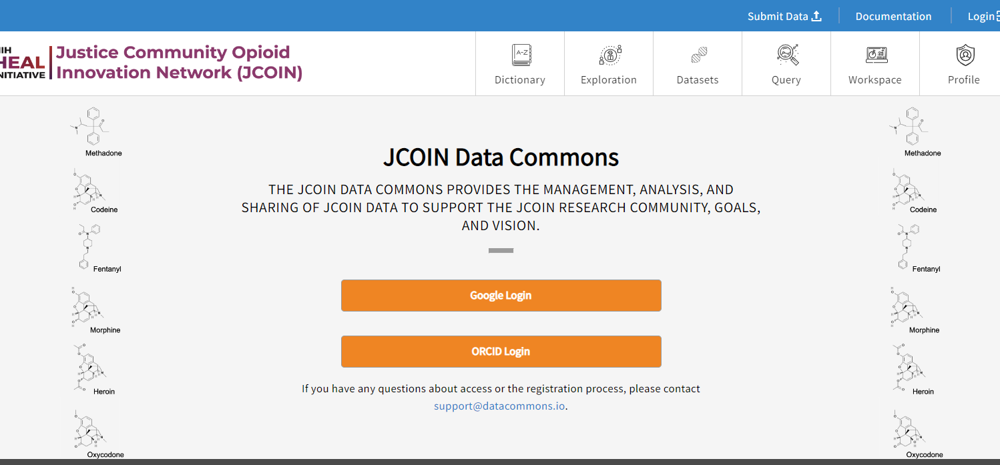

# Logging In to the Platform

You **will not** need to log in in order to:

*   _browse_ the documentation for the data commons 
*   _search_ the Core Measure (and other available) Data Dictionaries Search Tool

You **will** need to log in and obtain authorization (access) in order to:

*   _access_ studies in which you have been assigned permissions for 
*   _perform_ analyses in workspaces
*   _download_ data files and file manifests
*   _run_ the Core Measure Browser

Start by visiting the [login page](https://jcoin.datacommons.io/login).

## Login Page Options

*   **Login from Google**: You may login using any Google account credentials, or a G-suite enabled institutional email. This option may or may not be available depending on the institution or organization the user is associated with. Users should contact the IT support to verify if this option is available. For staff, students, and faculty of the University of Chicago, more information can be found [here](https://its.uchicago.edu/g-suite/).
*   **ORCID Login**: Users with an ORCID account can log in using their ORCID credentials.
*   **InCommon Login**: Users can login with a participating institution that is federated by InCommon. Click on “Select...” to browse and choose the institution.

After successfully logging in, your username will appear in the upper right-hand corner of the page.
