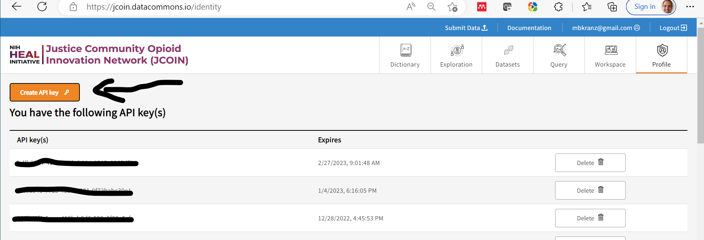

# Profile Page

On the profile page users can:

1. Find information regarding their access to different JDC resources
2. API key management 

## Access to resources

Find what resources you have by looking below the "You have access to the following resources" section.

Having access to resources (depending on the methods you have assigned) may provide access to a specific set of datasets/harmonized data or the ability to use certain features like the workspace and the Core Measure Browser. 

For example, a user from a hub may have access to their hub's project (and hence data and datasets) in addition to publicly available data. In this scenario, the listed resources may look like:

------------------------------------------------
**You have access to the following resource(s):**

Resource(s): | Method(s)
---------------| -------------------
/programs/JCOIN/project/FAKEHUB | read,create, other access privileges
/programs/JCOIN/project/FAKEOPENDATASET | read,create, other access privileges

## API Keys

API keys can be viewed, created, and downloaded on the Profile Page. API keys are necessary for programmatically interacting with the JDC platform.

To create an API key, 

(1) Click on the button:

(2) One can either download the token as a JSON file called `credentials.json`, which can be called directly into data commons tools or copied to your clipboard:

